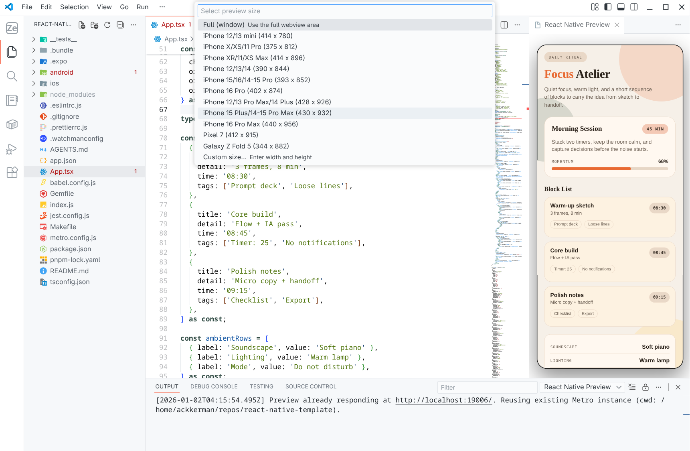

<div align="center">

    <h1>React Native Preview</h1>
    <h3><em>VSCode内でReact Nativeのプレビューを行う拡張機能</em></h3>
</div>

React Native Preview は Expo/Metro プロジェクトの Web プレビューを VS Code で確認し、ステータスバーと出力チャネルに状態を表示する拡張です。




## コマンド一覧

- **React Native: Open Preview (`rnPreview.open`)**: プレビュー WebView を開き、`npx expo start --web` で Metro/Expo を起動します。
- Open Preview 実行時にポート番号とプレビューサイズ（フル/端末サイズ/カスタム）を選択できます。未入力の場合はポート 19006 にフォールバックします。
- **React Native: Reload Preview (`rnPreview.reload`)**: 開いたプレビューを再読み込みし、Metro が停止している場合は再起動します。
- **React Native: Restart Metro (`rnPreview.restartMetro`)**: Metro を停止してから再起動し、プレビューを開き直します。

## ステータスバー表示

ステータスバー左側に「React Native Preview」が追加され、状態を表すアイコンとテキストを表示します。

- `$(preview) React Native Preview: Idle`: 拡張読み込み直後の待機状態。
- `$(loading~spin) React Native Preview: Starting Metro`: Expo/Metro 起動中。
- `$(play) React Native Preview: Metro running`: プレビュー URL が応答中。ツールチップでプレビュー URL とワークスペースパスを確認できます。
- `$(debug-stop) React Native Preview: Metro stopped`/`Stopping Metro`: 停止中または停止完了。
- `$(error) React Native Preview: Metro failed/not ready`: 起動失敗やプレビュー応答なし。詳細は出力チャネルを参照してください。

## 設定項目

- `rnPreview.previewUrl`: 既定値は `http://localhost:19006` です。Expo Web のホスト/ポートに合わせて変更できます。
- VS Code の Settings UI または `settings.json` で設定します。

  ```json
  {
    "rnPreview.previewUrl": "http://localhost:19007"
  }
  ```

- 無効な URL を設定すると、警告を表示し既定値にフォールバックします。

## Metro/Expo 要件

- プレビューは `npx expo start --web` を使用するため、ワークスペースに Expo/Metro 環境がセットアップされていることが前提です。
- プレビュー URL で Metro/Expo が応答できるよう、`package.json` のスクリプトや `app.json` の設定を確認してください。
- ワークスペースが複数ある場合は、Metro の起動フォルダーを選択する必要があります。

## トラブルシューティング

- VS Code の「出力」ビューで「React Native Preview」チャネルを選択すると、Metro のログやプレビューの状態を確認できます。
- プレビューが応答しない場合は、`rnPreview.previewUrl` の値と Metro/Expo の起動状態を確認してください。
